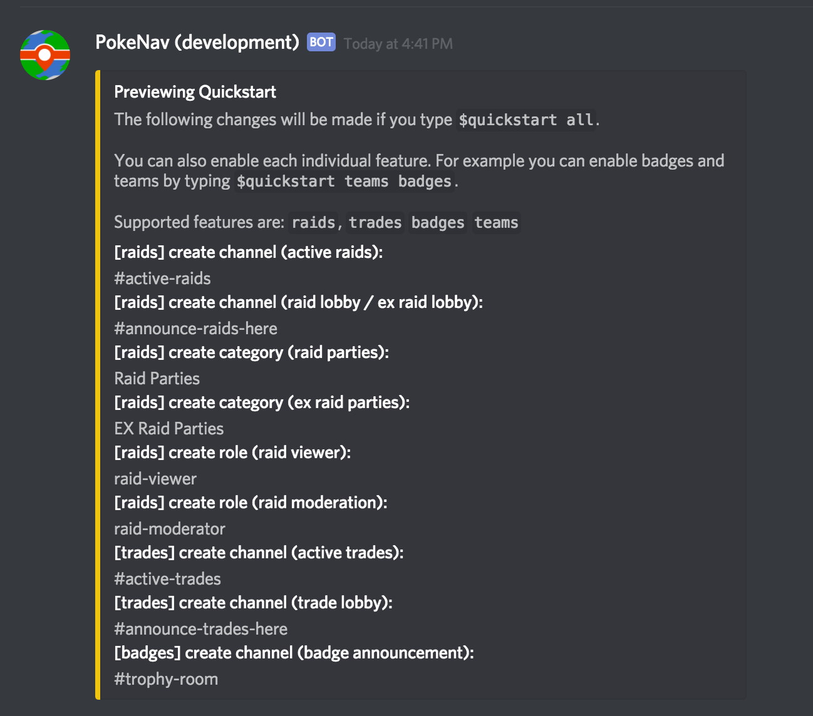

# Community Setup

## Purpose

This guide exists to help discord server owners setup PokeNav in their community.

## Trying It Out

If you want to test out PokeNav from a user's perspective, you can do so on the [PokeNav Discord Server](https://discord.gg/7M9quNd). The production bot is setup for users to interact with by posting raids, setting up their trainer profile and any other feature currently supported (except for moderation commands).

## Inviting PokeNav 

To get an invite link to PokeNav, please visit the [PokeNav Discord Server](https://discord.gg/7M9quNd). The invite can be found by reading the rules and faqs.

Once PokeNav is added to your server, it will immediately create a new channel called `#pokenav`. This is the moderation channel, it can be changed at any time, but a moderation channel must always exist. If you delete the moderation channel, PokeNav will attempt to recreate one within 15 minutes. You must be an adminstrator or server owner to see #pokenav.

## Configuring PokeNav

PokeNav can be configured to suit most communities.

How you go about doing it depends on whether you have an existing community with certain raid organization preferences or are starting fresh.

### Quickstart 

PokeNav comes with a moderation command called `$quickstart` which is designed to get new communities up and running in a under a minute. Here's how it works:

In your moderation channel (#pokenav), type `$quickstart`. 

Don't worry, nothing will happen. PokeNav will instead show you a summary of what it will do:

Let's go through what this means. 

PokeNav will do a bunch of things for you if you type `$quickstart all`. These can be changed, renamed or removed at any time. Lets go through each:

<dl>
<dt>Active Raids Channel (#active-raids)</dt>
<dd>A single channel where all raids in your server appear, no one but PokeNav can post here. Gives trainers a clutter-free view of every raid and the option to join any raid.</dd>

<dt>Raid Lobby / EX Raid Lobby (#announce-raids-here)</dt>
<dd>A single channel where users can post new raids. Commands to start raids will be ignored anywhere but in this channel.</dd>

<dt>Raid Party Category (Raid Parties)</dt>
<dd>Channels created to coordinate each raid will be placed under this category. If deleted, will place channels next to the Raid Lobby it where it was announced.</dd>

<dt>Raid Viewer Role (@raid-viewer)</dt>
<dd>Users in this role will be able to read and write in all active raid channels, even if they are not apart of the raid party. In PokeNav, raid parties are invisible to everyone but Raid Viewers and Raid Party Members.</dd>

<dt>Raid Moderator Role (@raid-moderator)</dt>
<dd>Users in this role will be able to perform privledged actions in raids. This includes ending the raid early, updating the public status or reseting the raid parties arrival status.</dd>

<dt>Active Trades (#active-trades)</dt>
<dd>A single channel where all trades in your server appear, no one but PokeNav can post here. Gives trainers a clutter-free view of every trade and the option to join any trade.</dd>

<dt>Trade Lobby (#announce-trades-here)</dt>
<dd>A single channel where users can post new desired trades (wants). Commands to start trades will be ignored anywhere but in this channel.</dd>

<dt>Active Research (#active-research)</dt>
<dd>A single channel where all research in your server appear, no one but PokeNav can post here. Gives trainers a clutter-free view of every research report.</dd>

<dt>Research Lobby (#announce-research-here)</dt>
<dd>A single channel where users can post research. Commands to report research will be ignored anywhere but in this channel.</dd>

<dt>Team Roles (mystic, instinct, valor)</dt>
<dd>PokeNav will attempt to automatically detect your team roles, or create them if they don't exist. Roles with the words `mystic`, `instinct` or `valor` will be detected automatically.</dd>
</dl>

Don't worry if everything isn't exactly the way you want it. You can immediatelly rename or delete any channel or role created by `$quickstart`.

You can also configure only certain features. For example, `$quickstart trades` will only setup the items in quickstart that start with `[trades]`. Since many features in PokeNav are configured by channel, this will defacto leave them off for your server. You can do this, for example, to use PokeNav for trades, badges and teams but skip raids. In that case, simply run `$quickstart trades badges teams`. Order doesn't mater.

Once you run `$quickstart all` you will have a fully functioning PokeNav installation with all features.

### Recommendations: Integrating Into An Existing Community

Using `$quickstart` described above can be valuable even if you don't want the exact setup it provides, since it will save you several steps (creating roles and setting team roles manually). There are commands to do everything done in `$quickstart` so see the moderation commands section for details.

#### Multiple Raid Lobby Channels

A common configuration is a server for a large area where each channel represent a town or neighborhood of gyms. PokeNav can handle an arbitrary number of raid lobby channels, simply run the following command in your moderation channel for each one you want to enable / disable:

`$toggle raid-lobby #channel-name`

If you also want to allow EX raid announcements, run:

`$toggle ex-raid-lobby #channel-name`

### Post Install

#### Setting Your Time Zone 

Make sure you use `$set timezone` if you are not located in the default timezone (US/Eastern). You can find a full list of timezones [at this gist](https://gist.github.com/heyalexej/8bf688fd67d7199be4a1682b3eec7568).

#### Changing Your Moderation Channel

You can use `$set mod-channel` to change the moderation channel -- if you already have a bot channel for admins.

#### Setup Your Mods

Once PokeNav is configured, add all your mods and admins to `raid-moderators` so they have permissions to end and mentor other trainers in using the bot. It will allow them to take any action the creator of the raid could take.

#### Additional Experimental Features

You can also setup some optional new or experimental features. To read more about these features, and how to opt in, head over to the [Server Settings Page](moderation.md)

Additionally, for remote only servers see [Remote Raids](remote_raids.md)
