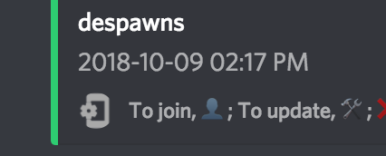
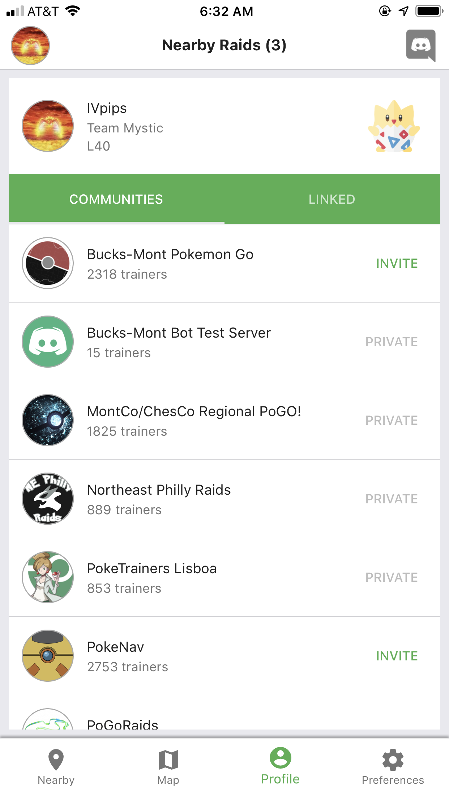
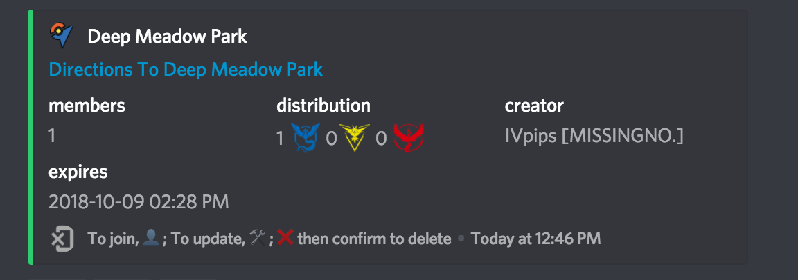
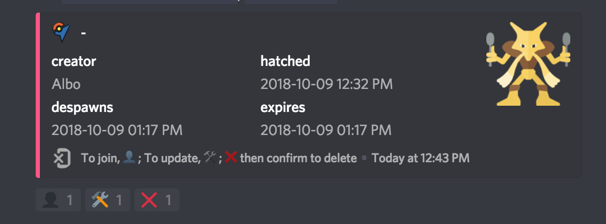

# PokeNav Companion App

The mobile app is a discord companion app available for free to all users of PokeNav. It allows you to quickly view nearby and global raids in a manner that would be impossible with just discord.

## Installing

You can install the PokeNav mobile app from the [Google Play](https://play.google.com/store/apps/details?id=com.minksoftware.pokenav) or [iOS App Store](https://itunes.apple.com/us/app/pokenav-companion-app/id1434217053?mt=8).

## Server Setup For Admins

In order to make best use of the mobile app and see your raids on the map, your server will need to make sure it is properly configured. To show a raid in the app, PokeNav needs to know its hatch and despawn time, as well as the exact coordinates of the gym where the raid is occurring. 

If it fails to detect either of these it may show up in discord but not on the map. Only one raid per gym is over shown in the app. EX raids are never visible.

You can easily tell if a raid is visible in the app by the icon in the lower left corner.

#### Visible In The Mobile App

#### Not Visible In The Mobile App

### Enable Server Invites

You can opt-in (default OFF) to sharing invites to your server. If you do, when users view raids reported by your server, they will have the option to click to join your server. Additionally, your existing members will be able to share a public invite link with others. If you leave this off, your server will look like this on profile screens:

To enable invites, `$toggle share-invite-url #channel`, where the channel is the welcome channel you want new users to appear.

### Setup Server Location

Use `$set location` to tell PokeNav where your server is located. This allows PokeNav to begin detecting your raid commands and screenshots for gym locations.

### Ensure You Have POI / Gym Coverage

PokeNav needs to know about the gyms in your area. If `$show-settings` shows no gyms after setting a location, you will need to request POI coverage, see the [PokeNav Discord Server](https://discord.gg/7M9quNd) for support and information on how to get coverage. Even if it does, you should request it anyway.

## Tips For Successful App Use

### Correcting Mis-read Raid Reports

You can correct raid reports if PokeNav fails to read the time or gym properly. See [Raid Page](raids.md) for more information how to set the gym or despawn time of a raid.

You can easily tell whats wrong with a report by checking two places, the gym directions line or the hatch time field.

#### No Hatch / Despawn Time

#### No Gym Found

### Delaying Raid Channel Creation

If you want to use the app like a raid map, you might not want channels created for every raid announced. Instead, consider disabling raid channels until someone joins them for the first time, see [the moderation docs](moderation.md#raid-channels) on how to do this.

### Using the iOS Siri Shortcut

We have created a siri shortcut that makes uploading images to discord much faster and use less bandwidth. In a nutshell, this resize and converts the image before giving you the option to share to discord. Afterward, it deletes the image from your photo library. You can use this to take a screenshot, go to the home screen and tap to share an optimized screenshot. Upload happens instantly.

[Download The Siri Shortcut Here](https://www.icloud.com/shortcuts/f336715cb05e4d5d81dc377296024bd4)

## Support and Feedback

If you need additional help, you can seek out help from your fellow users on the [PokeNav Discord Server](https://discord.gg/7M9quNd).
